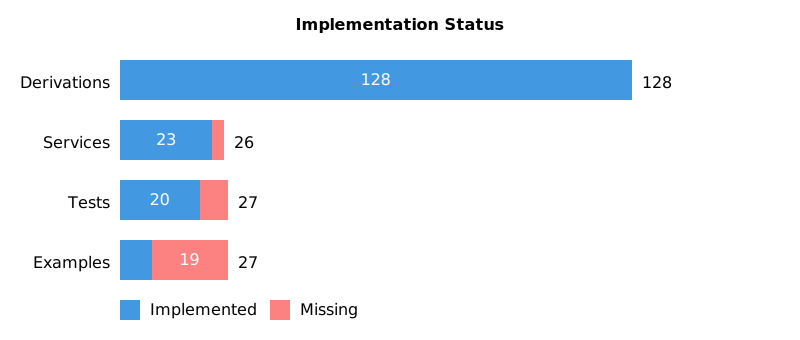
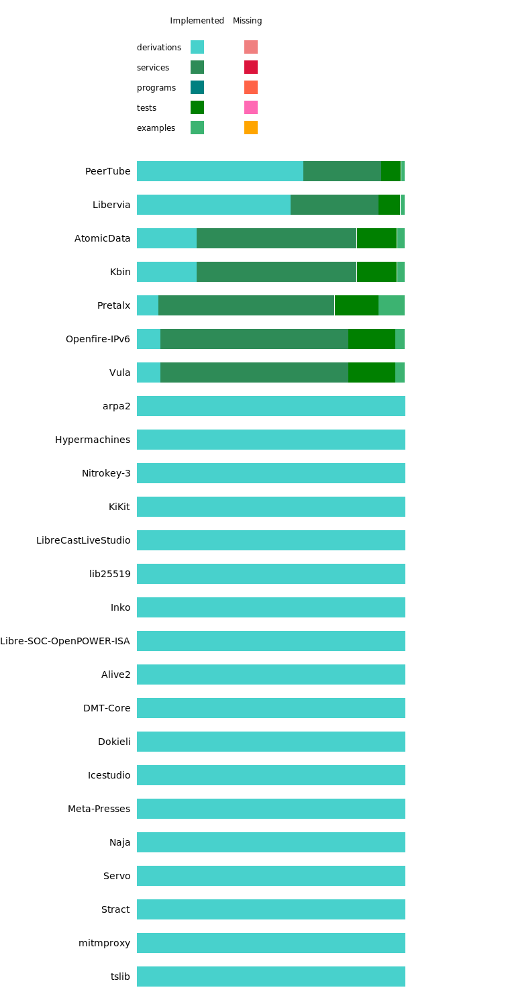

# 2024 Summer of Nix program report

*Written by Valentin Gagarin (NGI project manager for the NixOS Foundation)*

Summer of Nix is a coordinated effort to support free and open source software (FOSS) projects that are funded by the European Commission's [Next Generation Internet (NGI)](https://www.ngi.eu/about/) initiative through the [NGI0](https://nlnet.nl/NGI0/) consortium coordinated by the [NLnet Foundation](https://nlnet.nl/foundation/).

The program's main objective is to make more software available as Nix packages or NixOS service modules.
This is in order to make the projects developed under NGI0 easier to obtain and run – something that is not a given due to the complexities involved in software development – and thus help end users and developers to reap the benefits of the public funding campaign.
Nix itself is a proven technology for highly repeatable software builds and deployments, and supports an ecosystem of tools for building a fully transparent software supply chain.

This year's primary goal was to showcase high-profile projects by enabling an exemplary deployment experience on NixOS.
Just as last year, we focused on open hardware, self-hosted services, and federated social media.

Packaging artefacts for supported open source projects are now collected and presented in a monorepo called [NGIpkgs](https://github.com/ngi-nix/ngipkgs/), which is modeled after [Nixpkgs](https://github.com/NixOS/nixpkgs/), currently the [the largest, most up-to-date software repository in the world](https://repology.org/repositories/graphs).
It also serves as a staging area for maintaining software projects that may not (yet) fit into Nixpkgs.
Experimenting with managing what amounts to a highly structured software knowledge base already produced some innovations we hope to eventually upstream to Nixpkgs.

The 2024 Summer of Nix program once again followed the original idea from 2021, inviting early-career software professionals from all over the world to **work, learn, and meet**.
This year we concluded our trial of the mob programming format with a direct comparison to regular teams.
We also provided participants with a much tighter feedback loop, and actively coordinated tasks and schedules based on a detailed formalisation of deliverables.

Intermediate status updates were posted in a [NixOS Discourse thread](https://discourse.nixos.org/t/2024-summer-of-nix-program-updates/46053).

## Summary

- Activities from February 2024 to November 2024
- 27 people involved in 5 groups (2023: 18 in 3 groups)
    - 16 Europe
    - 5 North America
    - 2 Southern Asia
    - 1 Western Asia
    - 1 Eastern Asia
    - 1 Northern Africa
    - 1 South America
- 135 000 EUR allocated
- 87 890 EUR spent
    - 32 214 EUR for NGI0 Review
    - 26 661 EUR for NGI0 Entrust
    - 28 015 EUR for NGI0 Core
- Time worked: 3333.5 h
    - Average compensation: 26.36 EUR/h
- Worked on supporting 41 NGI-funded projects (2023: 22)
    - Recorded 201 pull requests or issue comments (2023: 80)
    - NGI0 Review: Finished all but one remaining and actionable requests
        - [Vula](https://github.com/ngi-nix/ngipkgs/blob/51b0776f33f94890d07a878bae38a01d1e38b42b/projects/Vula/default.nix)
        - [Libervia](https://github.com/ngi-nix/ngipkgs/blob/51b0776f33f94890d07a878bae38a01d1e38b42b/projects/Libervia/default.nix)
        - [GNU Taler](https://github.com/ngi-nix/ngipkgs/blob/51b0776f33f94890d07a878bae38a01d1e38b42b/projects/GNUTaler/default.nix)
    - NGI0 Entrust: 6 large and 5 smaller projects packaged
        - [Atomic Data](https://github.com/ngi-nix/ngipkgs/blob/51b0776f33f94890d07a878bae38a01d1e38b42b/projects/AtomicData/default.nix)
        - [Nitrokey firmware](https://github.com/ngi-nix/ngipkgs/blob/51b0776f33f94890d07a878bae38a01d1e38b42b/projects/Nitrokey-3/default.nix)
        - [Cryptpad](https://github.com/ngi-nix/ngipkgs/blob/51b0776f33f94890d07a878bae38a01d1e38b42b/projects/Cryptpad/default.nix)
        - [Canaille](https://github.com/ngi-nix/ngipkgs/blob/51b0776f33f94890d07a878bae38a01d1e38b42b/projects/Canaille/default.nix)
        - [Peertube plugins](https://github.com/ngi-nix/ngipkgs/blob/51b0776f33f94890d07a878bae38a01d1e38b42b/projects/PeerTube/default.nix)
        - [Libre-SOC](https://github.com/ngi-nix/ngipkgs/blob/51b0776f33f94890d07a878bae38a01d1e38b42b/projects/Libre-SOC-OpenPOWER-ISA/default.nix)
        - [Icestudio](https://github.com/ngi-nix/ngipkgs/blob/51b0776f33f94890d07a878bae38a01d1e38b42b/projects/Icestudio/default.nix)
        - [lib25519](https://github.com/ngi-nix/ngipkgs/blob/51b0776f33f94890d07a878bae38a01d1e38b42b/projects/lib25519/default.nix)
        - [Servo](https://github.com/ngi-nix/ngipkgs/blob/51b0776f33f94890d07a878bae38a01d1e38b42b/projects/Servo/default.nix)
        - [Naja](https://github.com/ngi-nix/ngipkgs/blob/51b0776f33f94890d07a878bae38a01d1e38b42b/projects/Naja/default.nix)
        - [Inko](https://github.com/ngi-nix/ngipkgs/blob/51b0776f33f94890d07a878bae38a01d1e38b42b/projects/inko/default.nix)
    - NGI0 Core: 6 services and 2 libraries packaged
        - [SCION](https://github.com/ngi-nix/ngipkgs/blob/51b0776f33f94890d07a878bae38a01d1e38b42b/projects/SCION-1M/default.nix)
        - [Open Web Calendar](https://github.com/ngi-nix/ngipkgs/blob/51b0776f33f94890d07a878bae38a01d1e38b42b/projects/OpenWebCalendar/default.nix)
        - [Omnom](https://github.com/ngi-nix/ngipkgs/blob/51b0776f33f94890d07a878bae38a01d1e38b42b/projects/Omnom/default.nix)
        - [Openfire](https://github.com/ngi-nix/ngipkgs/blob/51b0776f33f94890d07a878bae38a01d1e38b42b/projects/Openfire-IPv6/default.nix)
        - [Gancio](https://github.com/ngi-nix/ngipkgs/blob/51b0776f33f94890d07a878bae38a01d1e38b42b/projects/Gancio/default.nix)
        - [Misskey](https://github.com/ngi-nix/ngipkgs/blob/51b0776f33f94890d07a878bae38a01d1e38b42b/projects/Misskey/default.nix)
        - [tslib](https://github.com/ngi-nix/ngipkgs/blob/51b0776f33f94890d07a878bae38a01d1e38b42b/projects/tslib/default.nix)
        - [Alive2](https://github.com/ngi-nix/ngipkgs/blob/51b0776f33f94890d07a878bae38a01d1e38b42b/projects/Alive2/default.nix)
    - Again, dozens stale projects from past years archived
- Monorepo
    - Maintained weekly dependency updates
    - Built an [automatically generated project overview](https://ngi-nix.github.io/ngipkgs/) draft
    - Currently maintaining 45 projects with 128 derivations and 23 services
      - See graphical overview of component completion below
      - See appendix for detailed completion status of all projects
    - Of at least 450 eligible NLnet subgrants:
      - 170 software projects have some Nix packaging (including upstream)
        - ca. 100 are under continuous integration 
      - More than 200 are unpackaged
- Outreach
    - Participated in a podcast recording of [Full time Nix](https://fulltimenix.com/episodes/valentin-gagarin)
    - Recorded [7 mob programming sessions](https://www.youtube.com/playlist?list=PLt4-_lkyRrON3T2VfDyilSoMeuWKecp_V)
    - 9 Summer of Nix participants attended [NixCon 2024](https://2024.nixcon.org/), 2 presented [a talk about their experience](https://www.youtube.com/watch?v=f2zkEHPtKAM)
    - Participated in the NGI0 communications working group meetings and [relayed messaging to the Nix community](https://discourse.nixos.org/t/interviews-with-ngi-software-project-authors/51074)
    - Started public discussion in the Nix community on [improving cost effectiveness](https://discourse.nixos.org/t/is-summer-of-nix-worth-the-money/43856) and [adjusting implementation strategy](https://discourse.nixos.org/t/help-wanted-planning-for-summer-of-nix-2025/47556) for Summer of Nix

## Evaluation

This year's main achievement is that we have enabled a turn-key deployment experience for a number of highly visible, maturing software projects that would otherwise have prohibitively complex setups.

We also made some progress with presentation and discoverability of results, primarily by clarifying requirements for the underlying information architecture.
But emphasis was clearly on delivering working software.

The program's public reach has shrunk compared to last year, with view counts between 150 and 1700.
On the one hand, this is because we put much less emphasis on active storytelling and publicity.
On the other hand and more importantly, the Nix community, our primary audience, went through a governance crisis this year.
This resulted in many people leaving, and the surrounding events likely consumed most attention.

The developments in the Nix community also resulted in some ongoing work getting delayed and a larger than usual number of participants leaving the program early, which is why 34% of the budget allocated for this year was not spent.

### What went well

- Collaboration: Participants and authors of some projects successfully worked together
- Output: Many more projects were worked on and completed than last year
- Monorepo: All tested code was continuously provided with up-to-date dependencies and kept in working state
- Scope: Defining and obtaining more concrete success metrics enabled better overview and planning
- Consistency: More proactive coordination resulted in overall positive [participant feedback](./participant-survey.html) and kept focus until the end
- Continuity: The program was active throughout most of the year, and most requests by stakeholders were addressed within reasonable time
- Diversity increased: only a proxy metric, but 5 of 27 participants (18%) used pronouns other than "he/him" (2023: 1, 5%)

All of these achievements build on dedicated time investment:
- I actively tasked contributors to contact certain project authors and provided guidance on how to communicate.
- Team leads put in extra effort to select suitable candidates and helped them deliver good outcomes
- We allocated extra budget for monorepo maintenance (ca. 800 EUR per month)
- We strengthened project management compared to last year, by establishing tighter feedback loops, and by involving more people in triaging projects and refining our workflows.
  This led to improved structure, coordination, and continuity, but (together with underspending the development budget) resulted in 25% overhead costs.
- While preparing our call for participants, we reached out to 22 organisations promoting diversity in tech, receiving 3 replies.

### Improvements over last year

The 2023 Summer of Nix report stated improvement goals, which we mostly reached:

- Improve the technical introduction so participants can get started more quickly.

  Two of the four team leads were Nixpkgs maintainers, and set up their groups around a mentorship model instead of mob programming, which clearly yielded better results (7 mid-to-large and 10 smaller vs. 1 large and 4 mid-sized projects).
  Independently produced improvements to documentation in the Nix ecosystem additionally allowed us to point beginners to known-good materials.

- Keep up motivation until the end.

  Each group had a ceremonial debriefing call.
  We offered all participants an opportunity to get a free NixCon 2024 ticket, and 9 attended.

- Consider more support roles, such as technical writer, community manager, web master.

  We had a dedicated infrastructure specialist and a monorepo maintainer, which both proved invaluable to keep participants unblocked.
  This should continue if possible.
  We also planned work on contributor and user documentation as well as web design, but that didn't materialise as intended.
  We should try again next year, and also consider a role focused on increasing developer productivity.
 
  This was also the first year where we had support from an administrative assistant hired by the NixOS Foundation, who ensured timely payment processing.

- Make Summer of Nix more than just about NGI.

  Given we faced enough challenges with running the program, we couldn't dedicate any time to following up on this idea.
  It also seems not worth pursuing it in the next years, either.

- Have at least one person available for answering questions and making more high-level decisions.

  We implemented a regular meeting schedule and I took a more hands-on approach to project management and technical direction, both of which achieved the desired outcomes.
  
- Refine administrative workflows and documentation.

  After identifying time-consuming tasks, we did some streamlining and started introducing automation where possible.
  This did not save time for organisers compared to last year, but substantially reduced the number of interactions with participants regarding paperwork, which shows in largely positive feedback on that matter.
  We also reduced both the average and variability of payment request turnaround times.
 
  Leveraging our ever-growing collection of accounting data allowed us gaining important insights into the mechanics of the program.
  It also enabled us to run ever more detailed spot checks for NLnet and drastically reduced the time required to produce financial and quantiative progress reports.
  I recommend capturing more stuctured data as we go (including, where it's sensible, backfilling records from previous years), and continuing with judicious automation of repetitive tasks.
 
- Consolidate information in fewer places.

  66 stale code repositories were archived, and we are left with 60 that may still be relevant, many of which can eventually be integrated into Nixpkgs.
  There are only 2 private repositories left for admin information, at least one of which will be decomissioned eventually.
  We reduced the number of active Matrix rooms to 2 (one private, one public), and left small group conversations to ad-hoc rooms.

  Long-term we should strive to migrate all of the code to Nixpkgs, but this will require upstream infrastructure improvements we currently cannot afford or expedite.

### On mob programming

The direct comparison between mob programming and mentorship workflows has shown the following:
As we already found last year, mob programming is very good for equalising knowledge distribution, and effective at building up group cohesion, which resulted in better attendance than in mentored groups.
But the additional cost introduced by multiple people working on the same task is only worth it where sharing specialist knowledge is mission critical and the knowledge can be reused for immediate follow-up tasks.

Mob programming also requires certain conditions to be met to really shine, such as a rather high degree of professional maturity and a sufficiently diverse skill set among group members.
This mostly doesn't match our program or participant profile, and developing packaging code allows for only limited reuse of acquired application-specific knowledge.

Working with individuals or pairs well versed in specific topics such as web services proved to be both more effective and more economical.

My conclusion is that we should keep knowledge sharing as a very important concern, but address it selectively depending on circumstances.
There are also multiple measures we can implement to increase team cohesion, such as brief daily meetings or special events.
There may still be cross-cutting concerns in our code base that could benefit from a group looking into them together, but this is likely to be an exception to be dealt with case by case.

### What should be improved

- User experience: Substantial tacit Nix knowledge is required to make use of software distributed through NGIpkgs.

  While we cannot address ecosystemic challenges given our primary delivery goals and with our limited means, improving discoverability and streamlining interactions for consumers of our software distribution would significantly increase the visibility and impact of work done in the past years.

- Ecosystem coverage: Massive amounts of work for packaging NGI projects were already done by volunteers, but we don't have much visibility into its quality and completion.

  Triage and survey more projects to expose them in an overview.
  This will likely also require refining our data models and monorepo architecture.

- Knowledge transfer across teams: We didn't address that need despite aspiring to it for three consecutive years.

  This requires additional coordination we weren't able to muster so far.
  It may help to define some quantitative goals (such as targeting monthly exchanges) and distribute the work involved (such as having each team lead organise an exchange).

- Long-term sustainability: We still rely too much on volunteering to keep packages maintained.

  Involve and train more project authors early on so they can tend to their own code.
  Project authors are generally the most likely to stay around as both users of and contributors to the Nix ecosystem if adopting Nix into their workflows provides them with benefits.

- Continuous improvement: Encourage and enable participants to improve Nix ecosystem tooling and documentation as they work with it.

  Contributor friction has been lamented repeatedly over the past editions, and we still lack a handle on the problem.
  Embedding a feedback cycle ("boyscout rule") into our workflows could address it to some degree.

- Cost effectiveness: Reduce average cost of deliverables.

  Packaging a medium to large project with a service module currently on avergage costs us around 5 000 EUR.
  This likely can be brought down to 3 000 EUR, without upstream assistance, by organisational measures alone.
  It could be even less if we leverage project author's domain expertise, since much of the time is spent on getting familiar with the specifics of each project.

- Forecasting: Improve accuracy of cost estimates for future work.

  One reason for suboptimal resource use was that program participants in 2023 and 2024 based their work primarily on project priority, with only very coarse complexity estimates available.
  This repeatedly led to the sunk cost fallacy, which could have been avoided through more disciplined forecasting based on priors.
  Leverage our accounting history for predictions, and establish estimates as an integral part of the contributor workflow.

- Overhead: Reduce management expenses to below 15% of the spent budget.

  We've built up enough of a system to keep administrative efforts to a minimum and divert more energy to implementation tasks.

- Plan for additional outreach efforts.

  This largely did not work out despite some brainstorming and attempts to make time, primarily because participants were busy enough finishing packaging work they had started.
  As a result we had roughly the same level of activity around publicity as last year.
  While this has lower priority, next year we should still try to improve our outward communication by hiring for a support role.

- Build a more reliable hiring pipeline.

  Over the course of the year, we put some thought into improving talent acquisition, and building stronger relationships with participants helped retain some of them for follow-up work.
  Yet, staff planning, recruitment, and hiring still need more systematic integration with our procedures.
  In particular we should work towards finding domain experts for specific tasks that have shown to be time sinks for generalists.

  We should also do more to identify prolific volunteers, and reward them for or support them with finishing relevant ongoing work.

- Reduce experimentation: By now, we have learned enough organisationally, and now need to increase goal-oriented productivity.

  There are some smaller questions left we may need to answer by trial and error, but the broad strokes of how to run the program effectively are well-established and documented in these reports.
  Follow the insights collected over the years, and systematically implement all necessary procedures and optimisations.

## Lessons learned

A big part of the friction I experienced comes from the sheer number of people involved, many of whom were new to the Nix ecosystem.
Originally this was by design in order to bootstrap the program and grow the contributor community, and then became somewhat of a tradition.
As a result, we spent a lot of time with onboarding rather than delivering.

In 2025 we should de-emphasise the seasonal program model and shift to year-round staffing, with much fewer, more experienced people working on longer-term engagements.
I expect this to help address many of the challenges discussed in this report.

## Goals for the next years

As already stated in the [2023 Summer of Nix report](https://github.com/ngi-nix/summer-of-nix/blob/main/2023/report.md#goals-for-the-next-years), I recommend to keep narrowing the focus on key strategic objectives in the remaining years 2025 and 2026.
Apart from continuing to improve implementation quality and program organisation, our next big goal is:

Enable as many project authors as possible to maintain their own Nix-based development and distribution setups.

Their work is the cornerstone of the NGI0 ecosystem, and our mission is to support them with ensuring repeatable builds and correct deployments for their software.

# Appendix

## Participant survey

[Participant survey](./participant-survey.html)

## Completely packaged projects

## Incompletely packaged projects

