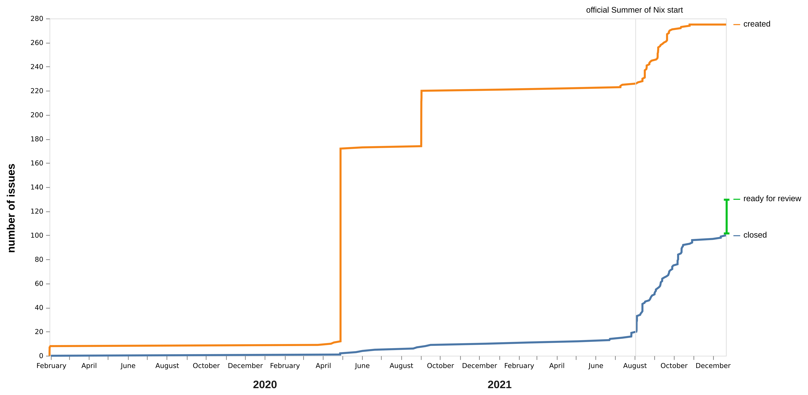
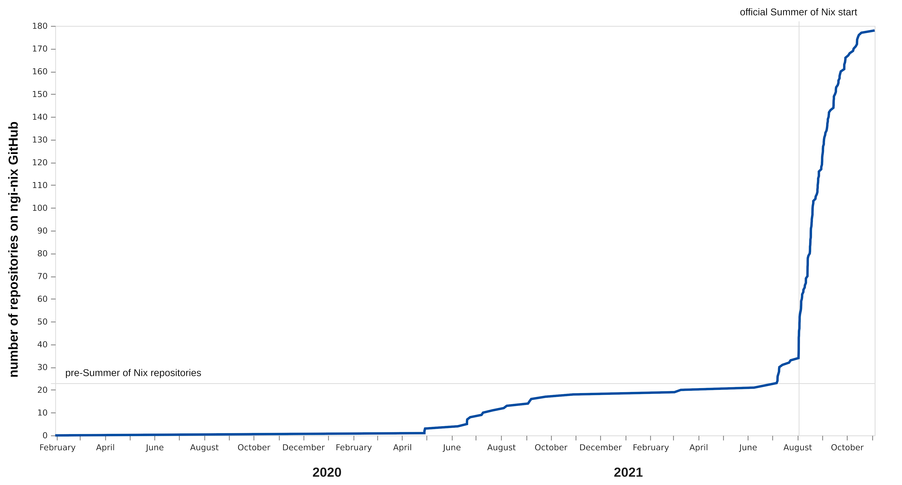
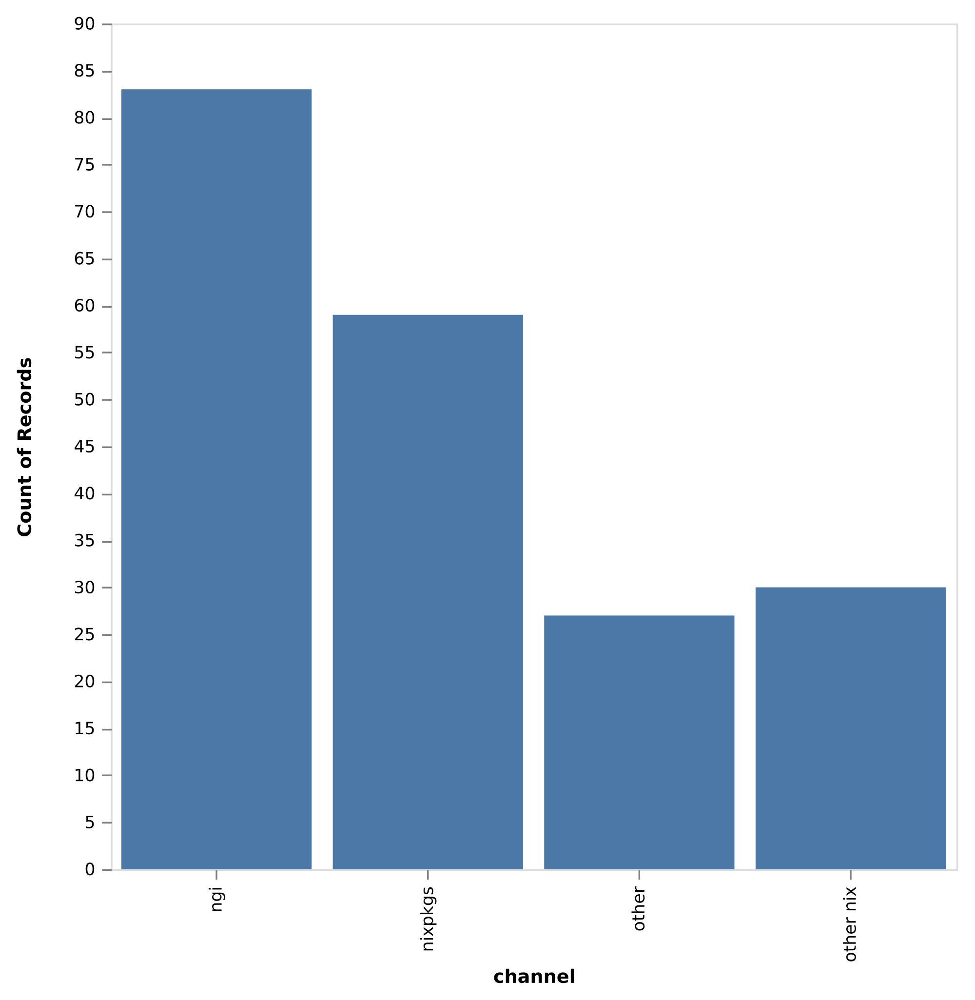

---
abstract: |

  _The Summer of Nix 2021_ was a large coordinated effort to reproducibly package Open Source software, making it readily available and usable by anyone. The program brought together independent developers and community enthusiasts for two months to write build-configure-run instructions with the next-gen reproducibility-first package manager Nix. This report retells the story of how and why the project came into existence, what constraints and design choices shaped it, how we organized it, what problems we encountered while it was running, and finally what its outcome was including feedback from the participants. I hope it is an interesting read for the funding organizations, future organizers and participants alike.

---

# Context

## Free and Open Source Software in a complexity crisis

<!--
Decentralized Internet Vision because of resilience, control over data, making the infrastructure available to everyone
-->

The Internet should be an open, decentralized, and privacy-respecting network of equally important nodes, built on top of a tissue of Free and Open Source Software (FOSS) allowing anyone to build new and innovative applications. This vision, ultimately derived from the fundamental idea of a participative society of sovereign citizens, is pursued by many community and political actors[@ecstrategy]. But in reality, much of the present day internet is under the domination of a few big actors behind tightly controlled ecosystems and with enormous power.

<!-- open and diverse ecosystems vs controlled standardized -->

Unfortunately, a tissue of Free and Open Software comes with complexity that tightly controlled ecosystems can often avoid. In practise this means that FOSS applications are often more difficult to install, configure and run than proprietary alternatives—a natural consequence of the enormous diversity of approaches that thousands of self-thinking developers without centralized organization come up with. These developers use their favorite programming languages, dependencies, operating systems, distribution formats and platforms, and their software often needs to be compiled from source. Although this diversity is a _feature_ of an open ecosystem greatly fostering innovation and resilience, it comes at the price that it is often more difficult to actually set up and run. The cost of setting up a FOSS ecosystem, is thus often higher than paying for an out-of-the box proprietary, fully integrated but opaque solution. This problem has been recognized for a long time in computer science circles[@linus; @mancoosi].

<!-- Nix as a solution to reproducibility -->

The package manager Nix[@doolstra2004nix; @nixosHow] is an emerging technical solution to manage FOSS complexity, and as such, a central component to make the Open Source vision a success. Making FOSS easily available via Nix was the “raison d'être” of the _Summer of Nix_ program.

## Institutions and their interest in the Summer of Nix

Four institutions with different interests teamed up to realize the _Summer of Nix_:

The **European Commission**[@ec] (EC) was the initial _source of funding_ for Summer of Nix via their Next Generation Internet (NGI) initiative. The goal of NGI is to “shape the development and evolution of the Internet into an Internet of Humans. An Internet that responds to people’s fundamental needs, including trust, security, and inclusion, while reflecting the values and the norms all citizens enjoy in Europe” [@NGI]. NGI is a huge program and funds a large variety of projects and subprograms with 312 million Euro between 2018 and 2022.

The **NLNet Foundation**[@nlnet] (NLNet) is an independent foundation, largely aligned with the above stated mission of the EC's NGI initiative, funding independent developers to work on FOSS for a long time. NLNet had been charged by the EC, via their cascading grant mechanism, to _distribute_ parts of the NGI funds. This concerned specifically funds from a subprogram called NGI Zero [@NGI0] that “provides grants to individual researchers and developers as well as small teams to work on important new ideas and technologies that contribute to the establishment of the Next Generation Internet.”, and within NGI Zero from another sub-initiative called PET [@PET] that focuses on privacy and trust enhancing technology. Plenty of FOSS solutions that NLNet funded within this setting, faced the outlined FOSS complexity challenge to reliably build and deploy. Looking out for a technical solution, NLNet chose Nix as preferred packaging strategy because of its unique reproducibility guarantees and other features such as composability that allow to realize their, and NGI's wider vision. This is how parts of the funds became available to package NGI-funded software with Nix. NLNet has approached the NixOS Foundation to help them with this packaging effort.

The **NixOS Foundation**'s [@nixosfoundation] mission is “to support the infrastructure and development of the NixOS project as a whole”. It's scope of action is limited to essential tasks in the Nix ecosystem because of limited resources, but also because Nix is managed to a large extent by a vibrant and self-organizing community. The availability of funding for Nix packaging from NLNet was of course a welcome opportunity for them to enlarge and improve the Nix ecosystem. The NixOS Foundation thus started to work on packaging with individual contractors. They set up infrastructure such as a continuous integration server, and a task lists, before the idea of Summer of Nix even came up. But the NixOS Foundation lacked the manpower to drive this program forward more actively. This is why the idea of a collaboration with Tweag came up. In this collaboration, the NixOS Foundation was the _administrating organization_ of the Summer of Nix, handling contracts, payments, IT infrastructure and more, but could stay largely out of program design and daily management.

The final actor, **Tweag**[@tweag], is a software consultancy and one of the principal enterprise user and contributor to Nix. Tweag sponsored project management, free of charge, to actually _design, organize and run_ the Summer of Nix. Tweag's interest are to improve and give visibility to Nix, and to foster and participate in a lively community around it.

# Designing and running Summer of Nix

_This section is written for those interested in the organization behind Summer of Nix, the program constraints, the reasons why certain choices were made, and also what organization of such a program meant concretely. If you are interested in the outcome only, you might want to skip ahead._

## The idea emerges

<!-- What is it -->

<!-- idea came from developer feedback: -->

The initial idea to run a large, concentrated community program in the summer, came up as a reaction on feedback from the Nix community about the already existing packaging effort with individual developers working independently through the large number of NLNet projects. The existing effort was not advancing as well as it should have, and it appeared not appealing enough to attract enough applications:

<!-- unqualified with no time to learn -->

Many community members felt unqualified to work professionally with Nix because, as an emerging technology, it had been often only a hobby. Many also felt that there might not be enough support and time to learn the required skills during professional work. The entry barrier to applying for a packaging job was therefore quite high.

<!-- packaging research tools is unattractive -->

Another aspect was that independently working on packaging was in itself not perceived as attractive work, where besides delivering one could learn new things and make connections. This was reinforced by the fact that many of the NLNet tools to package were still experimental, in prototype stage or alpha stage, without gigantic user base and sometimes no regular maintenance. Finally, although the program was decently funded, it was also not the place to get rich over night.

<!-- Real challenge: What excites developers? -->

The main challenge therefore was to design a program that is more attractive, and fulfilling, taking into account the _non-monetarian_ interests of the participating developers as much as those of the funding organizations to find the famous win-win situation.

<!-- What excites developers? -->

A few of the principles of the program emerged quite naturally from these thoughts. Participants should explicitly have time to **work, learn and meet**. Coding should not happen in isolation but in groups, with regular discussions and feedback about the work. Participants should not only learn but also teach their peers to make use of their skills as good as possible. The program thus became much more than a simple coding gig, and we hoped that it would be a lot more attractive for participants.

<!--The money question -->

However, the challenge was to actually _realize_ a project in the above spirit, open for beginners, with a lot more freedom for each participant to learn, teach, experiment and meet while applying their creativity, ideas and newly generated knowledge to useful work. One implication of this was that we had to go away from a professional software engineer's salary to stay within our given budget and to deliver the expected outcome with the allocated money. We decided to align payments slightly above Google's Summer of Code rates instead.

<!-- the manpower question -->

Another challenge was that we had only very limited number of organizers available to actually run the program: Even I, as the principal organizer, was not able to work full time on this project by far, although my employer Tweag generously supported me as they could. In addition, a small group of largely volunteer organizers helped that were a bit on-and-off depending on their time. It was clear from the beginning that a program with an emphasis on community and team work required a lot more work and that we needed further help, maybe in the form of a few selected people who would be experienced with Nix and willing to coordinate teams. The idea of “mentors” was born.

<!-- designing under constraint -->

The limited amount of dedicated time on the organizational side was probably the most constraining factor throughout the program, more than the budget. This was further exacerbated by the fact that we were starting this without experience and no prior infrastructure from scratch. But this constraint was clear to everyone from the beginning, no situation is ever perfect, the opportunity to realize the program was there _now_, and we thought we had a good chance to deliver something decent despite the constraints.

## Fixing the basics: compensation and time frame

<!-- interviews -->

The general idea “try running a condensed community program to make NGI packaging more fun, effective and valuable for everyone” was thus clear, but what was _not_ clear was the number of applicants to expect for something like this, and also not how to put it in practice. Initially we guessed to maybe receive 10-15 applications of which certainly a few would drop out. Running the program with a team of about 5-10 people seemed realistic. With this guesstimate in mind, we fixed compensation, the time frame from August 2nd to October 15th, and also the mentor role so that we could make an announcement and find out.

<!-- compensation -->

Compensation was fixed to a flat base rate of 2750 Euro per participant for 8 weeks of full time work anywhere within the EU, a gesture to the entity who ultimately funded this project, and otherwise adjusted for purchasing power based on a list from Google's Summer of Code in lack of a better resource. We considered worldwide equal pay as well, arguments for and against came up, but ultimately we decided to adjust, mainly because this was recommended by the European Commission and others who had more experience than us with the implications of one over the other. It meant that participants from EU countries with lower purchasing power made the best deal now because of the flat rate which corresponded to the rather high one at the NLNet Foundation's seat in the Netherlands. Payments themselves to all corners of the world were to be handled by the NixOS Foundation and NLNet, experienced with this type of situation. One additional thought about compensation is that we didn't fix it based on the total available budget but based on a rough idea of what was expected to be delivered for the money in the given amount of time. With the above compensation, a participant, on average would have to deliver roughly three packages over the eight-week period—a number that we expected to vary hugely because the software to be packaged was so diverse. Still this number remained a rough guideline for us to see how this more freely organized community event faired economically in direct comparison with independent developers, of course, not taking any of the additional benefits of a community event for the developers and the community besides packaging into account.

<!-- time frame -->

The time frame from August 2nd to October 15th was also not easy to decide. We wanted to hit university breaks across a variety of countries but didn't really have the data for this at this moment because we didn't know where participants would be applying from, but also because it is simply not easy to obtain because each country, and even university seems to have different exam seasons and so on. The Southern Hemisphere was (as unfortunately so often), a bit disadvantaged by the fact that this was in their winter break and even just by the name of the event. Unfortunately, we weren't able to find a better solution for everyone within the limited time we had. For participants, we designed the program for 8 weeks, 320 hours, of full time work in the total 10-11 week time span, a bit similar to Google Summer of Code, so that actual work could be accomplished but leaving flexibility to take vacation or start earlier. We couldn't grant too much flexibility to make sure that there was enough overlap for everyone to actually work together in a team. The compensation stipend was to be paid in two chunks, after working the first 160 hours and then the second 160 hours. When we came up with this, we expected to see the tangible outcomes in the form of packages and other code contributions in the second half of the program and thought the first 4 weeks will surely be required to get up to speed. This is something which turned out not to be true at all.

<!-- mentor arrangement -->

The mentor arrangement was a bit different. For the mentors, we kept the original rate that independent NLNet packagers received, about 50 Euro/hour, significantly higher but expectations and responsibility were as well. This meant that we couldn't possibly employ the mentors full time over the duration. We thought mentors could be present for about 8 hours per week to coordinate and answer questions, and deliver a total of 100 hours over the 10-11 week program. I'll defer more thoughts about how this worked out to later in this report.

## Announcement and interviews

<!-- announcement -->

These basic decisions were enough to announce the program on the NixOS discourse [@sonannouncement] and see who would apply. We didn't want to shape up the full program before knowing who would actually participate. Applications were handled over email only because we tried to avoid sign-ups and reduce the barrier to participation as much as possible. Also email seemed more personal, especially when expecting maximum 15 applications anyway. We also decided to have short 15-30 minute interviews with everyone without exception to get a personal connection and also to answer potential questions.

The response to this announcement was overwhelming and much more than the 10-15 applications we expected. In total, we received **94 participant applications and in addition about 10 for mentoring**. Given the high number of applications Email quickly became an overhead, although we half automated it, and getting applications in a more structured form might have simplified things but we were stuck with this decision for now.

<!-- interviews -->

In the application email, we asked a few simple questions to the applicants: Who are you? Why are you interested in this program? What are you able to do with in Nix? What would you like to learn? When are you available? What time zone? Specific requirements? Optional CV. These questions turned out to be good and very useful to quickly assess the goals of the applicants. Because of our decision for interviews, we did over 100 interviews in about one month with a little team of four volunteers who were doing this besides their work. Again, in hindsight this was maybe not worth it and quite exhausting, but it also gave the program a very personal, respectful and warm touch. As interviewers we got a much better feeling for the Nix community, the wishes and goals of the applying participants, and therefore ultimately the program that we were going to run. During these interviews it became clear that we had a lot of enthusiastic, extremely nice and very knowledgeable people applying.

## Selection process and team building

<!-- why we needed to select -->

The sheer amount and the high quality of the applications was extremely motivating and made us want to turn forward time to get started, but it also brought us in the unpleasant situation of having to select and pick one good person over another—something we had hoped wouldn't happen anyway.

<!-- selection through team building -->

Once we saw the number of applications, we realized that we needed several teams to provide for the support structure that we wanted to achieve with this program. Ultimately we had a limited number seats in the program because of our budget but the upper limit was quite generous and what was really the decisive question was whether we could make effective use of the money. This was the moment where we had the choice to run a small, well-controlled program, or to try running one with an autonomous team structure that would scale. We decided to go with the latter for various reasons: we thought the latter was necessary anyway because we didn't have the resources to top-down direct much, it also seemed more fun and in the spirit of the program to setup something somewhat decentralized with lots of opportunities to network and connect. Finally, another important reason was that we wanted and needed to move much faster than with the previous packaging effort. Investing budget well means, for funding organizations, not only to invest optimally in a static world but also to do so rapidly. This time factor is often neglected. Out of these and other reflections we decided to go with **five developers plus one mentor as basic team structure**.

<!-- diversity -->

Then we needed to fill these teams, and, since this program was _not_ about just delivering code as quick as possible, but also about learning together and meeting other like-minded people, we didn't want to simply sort by “Nix skill” in whatever subjective definition and fill them up in order. In contrast, team **diversity** seemed to be highly desirable to actually make a fun program in the work-learn-meet spirit outlined above, naturally generating opportunities to learn from and have interesting conversations with each other.

<!-- geographical diversity -->

Unfortunately team diversity in all aspects wasn't easily achievable: A first decision that we felt forced to take was to have timezone-homogeneous teams that weren't spread over more than **±2 hours of time zone difference**, ideally less. Meetings and synchronous communication, _the_ essential part of the team idea, seemed too hard to organize with more than three people spread over America, Europe and Asia. We thus focused on geographical diversity _across_ but not within teams. This lead us to reserve 15 spots (3 teams) for Central European/African time zones, 10 spots (2 teams) for American time zones and 5 spots (1 team) for East European, Middle East and 5 spots (1 team) Eastern Asian time zones [we didn't have applicants from other parts of the world]. Although this distribution is biased toward European/African time zones, something normal because the funding came from there, this choice of numbers was mostly imposed by the number of applications from each region because by far most of them came from Europe. But, paradoxically it still gave a significantly higher chance to non-Europeans to participate, although there were less overall slots for them. Non-Europeans, here strictly refers to place of living at the time of the program, and some of those non-Europeans were Expat-Europeans. So, although we did have quite a range of continents and cultures present, we definitely didn't have anything globally representative, not even if one would focus on tech-savvy regions only.

<!-- gender -->

Another failure, as unfortunately so often in the tech world, was to achieve gender diversity. The only two (very strong) female applications weren't enough to even consider forming somewhat gender diverse teams.

<!--how we built the teams in the end -->

All this meant that we were left with building teams that were diverse along the axes of **seniority** and **nix skill**. We did this in a way which I'll call, for the lack of a better term, compartmentalized randomness: building on a 3×3 matrix of seniority and nix skill a random queue of applicants. The process was certainly not objective as basically any application process, but I think we were guided by reasonable principles. It meant in the end that senior Nix experts did have the highest chance to participate, simply because there weren't as many of them, but it also gave a fair chance to others.

<!-- other possibilities -->

We maybe could have considered additional axes to build the teams. For example, grouping people who were interested in similar technology, but this seemed to become too complicated under the other constraints and also a bit premature because we didn't go through the actual work yet in detail and hadn't thought about how to actually distribute it among the teams. Perhaps, rather than searching for ways to optimize teams further upfront, an additional mechanism to adapt and improve them during the program would have been something useful—but also potentially dangerous if done maladroit.

<!-- result -->

In any case, we have built seven teams of five with this process, meaning that we would have **35 participants and 7 (+1) mentors**. The additional mentor was reserved for additional tasks, and it would become clear later what those were. The total number of participants and mentors also determined the overall budget that we would need, which was higher than originally anticipated and meant that we were eating into money reserved for later, but it felt like a good investment since the application quality was so high.

## Timeline, issue organization, events and start

<!-- time lines -->

Everything that has been described so far, from the first idea to the end of the selection process, happened in a relatively short time period: It began end of January with a first mention of the idea in an email on January 22nd. In one of the oldest of about 500 Summer of Nix related email threads in my in-box (excluding auto-generated notifications) from February 6th it says: “we could have 4 participants FT for 5 weeks including budget for the mentors. This is probably the most challenging but also most rewarding endeavor and would need to be organized quickly if it is for this summer.”. The NixOS discourse announcement post came out on March 21st, and we reached the end of the selection process on May 16th after 100+ applications. There was really not a lot of time for planning afterwards, because after about one month of downtime, we had to start preparing work and events for 35 developers and 8 mentors to avoid major confusion.

<!-- work item preparation -->

As first preparatory measure, we started regular meetings with the mentors to onboard them gradually on the program so that they would know what was coming and even already start influencing it. The first question to answer was what we would be working on exactly and how work would be distributed. As mentioned earlier, we had one huge asset in this program that helped in this regard:

<!-- the issue list -->

Thanks to prior work from the NLNet and NixOS Foundations, we already had a written list of relatively independent work items, basically the 200+ NLNet projects to package, prepared as a long issue list on GitHub. Certainly, some information was missing in those issues, there were duplicates and some of them were simply not tractable, but overall this list was a treasure trove, and we would have had trouble to get ready in time without it.

<!-- assign and trade -->

Initially we thought about going through the issue list upfront, tag and distribute it to the teams, e.g. by technology. But we quickly realized that we simply didn't have the time to do this before the program started and that the list was too large to deal with it sequentially. We therefore opted for a different method which I'll call **assign-and-trade** here: The full issue list was randomly divided by the number of teams, seven, labelling every issue with a team label. Coincidentally the full list had quite precisely seven pages on GitHub which means that splitting and labelling was really easy to do. This distribution was definitely not optimal but rather just a random starting point: It surely meant that some teams would have more difficult issues than others, some teams would be missing the required skills to tackle an assigned issue, or they simply wouldn't be interested in it. This is why we introduced a trading mechanism so that teams could flag interest in an issue they liked or put issues on out for trade that they didn't want to work on.

<!-- packaging workflow -->

As further preparation, we also wrote a little, step-by-step packaging work flow to get everyone started quickly. This work flow also defined a few standards and roughly went like this: As developer you would look through the issues assigned to your team via filtering by GitHub label. Once you'd find an interesting one, you would assign yourself to it. An issue corresponds roughly to an independent NLNet project. The first step after assignment was to find out what it was about exactly, and what could actually be packaged. Once this had been done, you'd start packaging by forking the original repository to the [NGI-Nix](https://github.com/ngi-nix) GitHub organization, adding the Nix build instructions directly to it. Once ready there were several paths to continue: a PR to the original source repository (that is why we initially thought forking was a good idea), a PR to nixpkgs, Nix's official package repository, or simply leaving it as independent build instructions on the ngi-nix organization in an independent repository. Participants would work through this workflow alone but ask their mentor or other team members for help and support.

<!-- feedback via an independent reviewer -->

A question that came up was when those build instructions were considered “done”. As with most software work, one can deliver more or less complete and high quality solutions depending on the goals. We worried a bit about quality in general, because often developers are satisfied if something works for _themselves_ but not necessarily for somebody else. Although Nix gives certain guarantees about reproducibility, it can't guarantee that something is complete and documented enough so that it's usable. To drive quality high on the last meters of packaging, we decided to ask the 8th mentor to explicitly focus on this, to test the packages, give feedback and raise the bar a bit. We hoped that this would allow the mentors to concentrate on working with their team as much as possible without having to switch too much into the role of a counter-player themselves.

<!-- getting started with a test run -->

With the issue assignment strategy and the basic work flow, we felt ready to get started, but we were also scared to actually do so. Having 43 participants and mentors all begin at once without any test seemed audacious. The fear was not that our upfront preparation and game plan would work out perfectly, it was always thought more as a guideline for smart individuals, and with the little time that we had to organize the program we didn't hope to get anywhere close to perfection. But we feared to have missed something major that would block and demotivate the smartest participants from the beginning. Fortunately, two participants and their team mentor were willing to get started already in July, one month before the actual start date on August 2nd, to try what we had come up with. They started to package the first repositories, started to flag up problems and got used to the program.

<!-- events -->

Another aspect that I didn't mention so far was our plan to organize a presentation schedule for Summer of Nix—inviting core members of the community to talk about what they know best: their own work. For time reasons, we weren't able to organize this much in advance and thus decided to go for a more interactive and flexible approach. I thus only organized a kickoff meeting on Monday 2nd of August, and the first technical presentation, by the inventor of Nix Eelco Dolstra, up front and add others on the fly during the program.

## Tooling

During the preparation phase, we also had to make decisions which tools we should use to organize this event. **Simplicity** over fanciness was probably our major guideline here. In addition, we tried to use **FOSS tools** because it corresponded to the overall spirit of the program and because they were often quicker and easier to use because no further budget and sign-ups were required. But we also decided to be **pragmatic** and use commercial tools whenever they were providing us with a clearly simpler and more robust solution.

Some of the FOSS tools we used (none of them self-hosted) were:

- Cryptpad for collaborative text documents and sheets. Cryptpad was quite feature complete and a good choice for collaborative writing and sheet calculations for organization. In our case, it competed with Google Docs which was probably better known by many and directly integrated with Google Drive. The latter was definitely an advantage for us, which is why we didn't fully move to Cryptpad.
- BigBlueButton for webinar-style presentations. BigBlueButton was great, we used an instance hosted by the TU Delft for this event. Other hosted instances seemed to be difficult to find. Especially the shared-notes and recording features of BigBlueButton were nice to make the presentations somewhat interactive.
- Jitsi for face-to-face video conferencing worked very well. No complaints. The fact that no-one had to sign up anywhere was a big plus, especially to later on organize the hiring event.
- Matrix for synchronous chat worked well also. The user experience of its main client Element (formerly Riot) is sometimes not as polished as in commercial tools like discord or slack but in general it did what it was supposed to do. The “Space” feature of Matrix, basically just a set of channels, was very nice to integrate open community channels with our private event channels. We had a very simple set up with few general chat rooms and then a single private one for each team.

Coincidentally, all of these project had received NLNet funding, and we worked on improving packaging for all of them during the program. Some of the commercial tools we used were:

- Hellosign for signatures
- GitHub for the issue list, program documentation, discussion board and the actual source code
- Google Drive and Google Docs to store administrative documents

During the project, we also worked on FOSS alternatives to these, so that in principle we could have run the full program FOSS-style. However, as I mentioned earlier, we had limited resources to set this up and needed to budget well what to spend our energy for. In addition to these tools, we used _a lot_ of simple Email for administrative purposes, to send out .ics calendar invitations and more, in cases where we could have used an external tool. This was nice in some way because everyone knows email and because it was possible to automate it to some degree—but for the size of the project it was probably a stretch and some more structured approaches could have helped.

## The program runs

<!-- project start, handover to the mentors -->

The strange thing about bigger projects from the perspective of the organizer is that the start doesn't really feel like the start because so much of the work seems to have already happened, and as soon as it starts rolling down the hill, it's much harder to influence where it'll end up. But it paid out to have clear, built-in day-to-day mechanisms for feedback, guidance, and decision-making, via the mentors who were admittedly dropped into a situation with quite some responsibility, little time for preparation and tight time budget (mentors were officially only available one day per week for coordination). The mentors handled the major part of the organizational work load from day to day, guiding, organizing and resolving as much as possible directly with their teams.

<!-- little vision about what actually happened -->

In this decentralized situation, maybe common but still something to get used to, no-one had an oversight over the whole program. Work was distributed and trust-based and everyone had just their own limited perspective. Participants knew most about the packages they were working on, mentors had a larger vision of their team activities and also the issue list, organizers were busy organizing. We also didn't have effective reporting mechanisms in place. Our global issue list captured only a small part of what was going on. In addition, participants filled out time sheets with weekly granularity, but we didn't have the time to read those until after the event. Other than that, organizers and mentors exchanged in weekly meetings and via matrix.

<!-- approximate organized events -->

Participants were mostly working on packages, learning and talking to each other autonomously. Organized events set a certain rhythm for the participants throughout the week: typically a team meeting (although this was left to each team to decide), and about every second week on Wednesday at least one centrally organized presentation, in two editions to cover all time zones. These presentations were given by invited speakers, some of them participating themselves in the program, others not, about in-depth but basic Nix topics more than about the newest and craziest ideas (for those who know Nix, we talked about Nix Flakes, Nix modules, the Nix RFC process, the nixpkgs release cycle, poetry2nix, dream2nix, EU Open Source politics). We also had a time slot on Tuesdays for participant presentations which was used from time to time. More happened of course behind the scenes, proposed by various participants, and in the different teams. Later in the program we sent out a list randomly assigning one or two meetings with someone from another team every week to foster cross-team communication.

<!-- difficult to describe -->

It is difficult to describe what happened exactly without diving into the details. The program ran in this manner more or less autonomously. I was even able to hand over coordination for 2 weeks to go on a vacation after a very intense half-year, and the program went through without bigger accidents, although of course problems came up and, as was to be expected, many things could be improved _even under the same program constraints_ if we were to repeat this program. But some only became clear _after_ the program when we asked for detailed feedback which I cover in a later section of this report.

## The hiring event

Before the program even started, an idea that seemed very valuable to pursue, even at the expense of having less time for organization of the main program, materialized:

I am a consultant at Tweag and often talk to companies using and adopting Nix. Similar to other emerging technologies, Nix is often a blessing and curse at the same time for them. Obviously an emerging technology solves previously unsolved problems, but it also often doesn't come with a job market that is as vibrant as for other tools. Immediately after the interview phase, I felt that companies could have great interest in meeting the candidates who applied for Summer of Nix, and I thought that the same was also true for many applicants, often considering Nix more as a hobby of theirs but not as something they might be able to find a job with. The idea to connect Summer of Nix applicants (even those who we didn't have spots for in the program) with companies adopting Nix was natural, but it meant further organization at a moment when we had little capacity.

Still, I took the decision that this was worth pursuing simply because it felt like this event would complete Summer of Nix: The hiring event provided a great point of motivation and direction. Summer of Nix would be about giving talented community members an opportunity and guidance to make the jump into the professional life, giving them the experience of delivering paid work but in a protected and freer environment. However, the decision to also organize the hiring event came at the cost that I had less time to spend on the main event and needed to fully trust that our team structure would work out OK. Also, we reduced the hiring event to the essential—a no-fuzz moment of connecting one side with the other in the most efficient and direct way. This was born out of necessity, but it probably became a feature because such an event saved precious time for the participating companies and candidates as well.

We thus compiled a list of more than 60 companies which we heard from different sources had been using Nix. Many of them are small to medium enterprises, but some are also very large, and we reached out to them. Of those 60 companies, 13 decided to actively participate in the hiring event. With these companies, spread mostly over North America and Europe, and participants across the globe, another challenge were time zones. We tried to duplicate every event within Summer of Nix to cover all time zones, but for this hiring event, we decided to go for a unique slot this time from roughly 5pm (UTC+2) – 8pm (UTC+2). There is no single slot available that covers West-Coast US to far-eastern Japanese time zones and this one was picked at the expense of Japan, for whom the event unfortunately was very late. But we felt we had no choice here.

The hiring event was structured in two big sections: First every company would give a short lightning presentation about themselves, then company representatives would go into on breakout rooms, their virtual booth, each and participants would move through these booths to have direct conversations with them. To make this an interesting event for everyone, we had to make sure that participant load in the booths was evenly spread, so that no company was alone or flooded with the majority of participants at the same time. We decided to build a schedule leaving some free space for flexibility. While the total duration of the event was constraint by time zones, an open variable was meeting length. Longer but fewer time slots would mean more participants per meeting, whereas shorter but more time slots could mean a 1-on-1 interview for everyone. We ultimately decided _against_ 1-on-1 meetings, because we didn't want to create an interview situation but rather an active and open conversation. But we also wanted to avoid webinar style one-directional situation with too many participants. We thus thought there might be an optimum somewhere between 2 and 5 participants per booth per slot. It turned out that with this number, the total number of participants in the hiring event, and the total duration of it, slots needed to be about 15 minutes long.

To build the schedule, we first asked participants and companies for their preferences. The rest was then essentially filling up a matrix of meeting slots × participants × companies, considering time zones, participant and company preferences at the same time (It would be absolutely great to write an online or command line tool for this). With some little helper scripts but also a ton of manual intervention, we came up with schedules.

In terms of tooling, we decided against any commercial solution and ran it entirely with the open video conferencing solutions BigBlueButton for the lightning presentations, and Jitsi for the booth breakout rooms.

The event itself was quite a success, and seems to have run relatively smoothly with few accidents. More feedback later in the feedback session.

# Contributions

_During the program I and others knew that everyone was doing _something_. We got a glimpse of each others work through daily meetings, chats and other means of communication. However, a larger perspective of what we have achieved as a group was very difficult to get until after the event. This section tries to provide some insight into this._

## Code contributions — summary statistics

It would be so comfortable to simply go through our issue list and check what had been closed. For several reasons this wasn't as easy. So before actually looking at the Figure, let's consider that:

The close state of an issue is often difficult to define. There are lots of 90%–done cases that aren't captured by closed issues. We tried to avoid this as much as possible but obviously couldn't do it entirely, and a lot of valuable work, such as packaged dependencies or working component packages, is within this group. We also had a “ready-for-review” label as additional issue state, but since our review team was probably under-staffed, we didn't manage to bring all of them all the way to closed. Also, issue granularity isn't fixed and issues are broken into smaller sub-issues that are then more easily closed. Still, considering these limitations, the issue list activity _is_ an important indicator and @fig:issues shows the number of created and closed issues as a function of time, as well as the number of issues flagged as “ready to review” that we ended up with.

<!-- activity on the issue list -->

{#fig:issues}

The figure shows that most issues were created (orange line) automatically in two big chunks, mid-2020 a year before starting Summer of Nix when the original packaging project with independent developers working as contractors started. The issues were created from an internal project database that NLNet maintains of each of the projects they support with grants. The number of issues grew further during the program, because some of these auto-generated issues were broken up into sub-issues and a few new projects were added directly by NLNet.

Issues were closed (blue line) for a variety of reasons, primarily because the work had been done but also for a number of other reasons. For example, some issues were duplicates, others referred to hardware-only projects without anything to package, others were intractable for other reasons. Issues that remained in “ready for review” state (green marker) at the end of the program are also shown. In absolute numbers, we have started with about 230 open issues at the start of the program of which a bit over 10 were already closed by prior packaging efforts. We ended up with a total number of 276 issues of which 101 were closed and 27 flagged as “ready for review”.

As discussed above, the number of issues alone doesn't give a good idea of the work involved because their size and difficulty varied drastically, even if they were valid packaging requests. Some involved simply bumping a version on nixpkgs because the associated project had already been packaged there, others involved profound work, for example bootstrapping, mobile NixOS, work on tooling to tackle badly supported language ecosystems, but also simply small but difficult-to-package programs and others with many unpackaged dependencies that also had to be delivered. Work on such issues could easily have taken the time of a single packager over the whole program's time frame and more.

An interesting number, although equally treacherous, is the number of issues closed or flagged as “ready to review” _on average per participant_. It was about 3.4, above our expected rate of 3. Again, this number is really only a gross approximation of work, and it doesn't capture any of the additional non-NGI packages, bug fixes, improved documentation and tooling and other contributions that came out of it. It also doesn't capture the quality of the contributions.

<!-- number of repositories -->

{#fig:repositories}

Another, similarly limited but still interesting, perspective of the code-contributions done during Summer of Nix is the number of repositories under the `ngi-nix` GitHub organization. Every tool to be reproducibly packaged went under its own repository, although there were exceptions such as upstream nixpkgs contributions. @fig:repositories shows that the number of repositories went up drastically once the program started, and a lot of new ones were created over the course of the program. All in all there are now about 180 repositories, many public but also some private, in the organization holding NLNet projects reproducibly packaged to varying degree. Not all of this work had been finished, and some was adjacent work and not directly an NGI package, which is why this number is higher than the number of issues closed or flagged for review.

<!-- add numbers about contributions channels from time sheets -->

{#fig:channels width=50%}

<!-- add numbers about additional team contributions from time sheets -->

Besides GitHub, another source of information are the time sheets that program participants had filled out during the program. We asked participants to list their contributions in there. Although it was a tedious job, we gathered every reported contribution, a whopping number of 199 repositories, upstream PRs or relevant issues to various channels in structured form from these time sheets (The full list is in the next subsection). @fig:channels summarizes _where_ those contributions went: most are repositories on NGI, filled with Nix package descriptions for the respective tools, then a lot of contributions, NGI packages, dependencies of them, bug fixes or improvements to documentation, went directly to nixpkgs, Nix' official software library. And finally others to the wider Nix ecosystem or to upstream repositories.

<!-- other Nix contributions -->

Most contributions to the Nix community, outside of nixpkgs, were bug fixes on the so-called 2nix helper tools to reproducibly package various programming language ecosystems. But also new and very interesting tools were initiated like dream2nix, static analyzer, contributions to documentation that hopefully simplify future packaging efforts, and two RFCs were written with suggestions to evolve the Nix ecosystem.

## Contribution list

<!-- this is replaced at build time with the list of contributions -->
{{contributions}}

## No-code contributions

In addition to just participating, one participant ran a Nix camp where one could hack on-site together. Another wrote a blog post for the Summer of Nix website. Yet another participant helped to record all video sessions (which turned out to be great learning material but unfortunately not produced to become public).

## Outcome _for_ the participants

If it's hard to evaluate the code-contributions of the program, it is even more difficult to say what the outcome was for individual participants. Some greatly enjoyed the program, became first-time maintainers on nixpkgs. Others got hired either by the project teams they worked on, or through the hiring event. Some didn't enjoy it as much and probably didn't take out a lot. I don't have exact numbers and had not even a vague idea here.

Directly from the time sheets, we could see that in total four participant dropped out—two of those before the program started. Not everyone finished the program fully either. The participant contract was designed to deliver 320 hours in two chunks of 160 hours. Basically everyone delivered the full chunk on the first half, but 5 participants finished the second part only partially for various reasons. This means that we initially had 31 participants working and a fewer at the end of the program.

# Feedback

We organized four open feedback sessions after Summer of Nix to gather thoughts about the program from the perspective of participants and mentors—ultimately the core groups of the program.

The overall experience was diverse, mostly positive, but also different from person to person and team to team. Some wider aspects of the program were universally seen as positive, and their absence regretted where it didn't work out:

- Participants universally appreciated in particular the **team experience, active communication and not working alone**. Some teams faired much better here than others, providing lively discussions, a weekly rhythm and a good support structure. But even in these teams, moments when participants, in particular those with less Nix experience, had to work alone on a package were seen as difficult. Other teams were much quieter and therefore the participants had a harder time. Similarly, from the mentor perspective a quieter team with star-shaped communication meant more work for the mentor because they were the principal fall-back point. The same theme, either appreciation of good support communication or the lack of it, came up in various aspects: Participants felt lost and mentors said that some were blocked for a long time without asking for help. It is no wonder, that all participants appreciated pair programming sessions that we later-on in the programming organized via two random, cross-team pairings per week, and regretted the lack of those in the beginning of the program. To summarize, it seems team work sometimes went very well, sometimes not. We weren't bad but there is certainly room for improvement here.
- The centrally organized presentations about the fundamentals of Nix by core developers with an interactive Q&A session attached were mentioned as highlights of the program. This was certainly not only due to the quality content but also due to the fact that this was a moment of community and also something that, similar to regular team meetings, gave a certain rhythm to the program. **Rhythm and structure** was a central aspect of the feedback in general. It seems we were definitely on the lower end, and more rhythm and structure would have been appreciated. Presentations, team meetings, and then later-on cross-team pairing sessions were all appreciated. In addition it was mentioned that motivation tapered off towards the end of the program, which might have been less if there were events like a closing ceremony (e.g. final presentations were proposed) to work towards. A mentor mentioned that the first week was super busy, so that they were barely able to work on day job and after a while the team got bored and work tapered off.
- Work distribution was another central aspect that generated some frustration: although the general assign-and-trade approach worked fine, some larger package families, that is packages from a similar programming language or software ecosystem, were spread across teams. It took a while to all bring them to the same people to tackle them jointly. And with the GitHub issue list alone it was difficult to see who worked on what and when. Furthermore, some participants would have liked to specialize on packaging software written in specific programming languages and we had no notion of that in our work distribution. On the other hand, I had the impression that some also enjoyed peaking into diverse and new technology. Probably a common denominator was that there was a perceived lack of ecosystem-oriented communication beyond the team boundaries, such as a simple Matrix channel to discuss Javascript packaging—so that every one has **an opportunity to follow their tech interests**..
- Another aspect related to motivation were the actual packages we worked on. Some of them, such as Jitsi, BigBlueButton, Arpa2 are very big, well-known tools, but sometimes demotivating because big and difficult to package. Inversely, others were small, prototype-like tools without regular maintenance where the question why we were spending time on them came up. Many felt that it would be worth to investing more time in central projects for the Nix community that simplify packaging in general. This became in particular clear when similar questions came up over and over from different participants. It was frustrating not to work on improving those directly. We somewhat allowed this, if it directly or indirectly helped for NGI packages and if someone had already worked on many “official” packages, but we didn't encourage it either because we were bound by the goals of the funding grant. **A clear answer to why we are working on something** would be appreciated.
- Some participants spend a significant amount of time on no-Nix and no-code tasks, chasing upstream/maintainers and so on. Few actually liked this part of the work and would have appreciated contacting project upstream maintainers beforehand to get cleaner task descriptions, or support with communication skills and what someone called “software archaeology”. Some packages were also just not possible to package, e.g. hardware related, and it was puzzling for some to be assigned to do something which isn't possible. **Clearer task descriptions** would have been great.
- we had no “formal” roles in Summer of Nix, besides participants, mentors and admin. However, some participants did take initiative and responsibility to organize things such as recording all presentations and distributing them, hosting code & chat sessions and more. Some were sliding in these roles and would have appreciated a more structured role distribution to know clearly what their tasks would be.
- Some aspects of the packaging workflow and work organization weren't ideal. E.g. the choice between external and internal flakes and between separate repositories or a big monorepo.

Then a few points about Nix came up:

- The Nix documentation was universally seen as difficult to read on many points
- Mediocre support for various ecosystems and bugs, and lack of documentation, templates and tutorials on how to use the various lang2nix tools. Simply finding and picking the right tool was a challenge as well because there is no unified place for this and there are many competing tools out there. Specific ecosystems that were mentioned are: Racket, Java, Android and Javascript apps.
- flakes restrictions were not a problem because it was part of the learning experience

Also some mentoring suggestions:

- Expect lots of similar questions: how to do overlays, how to do X. Also on ecosystems on tooling. Explain common themes such as lang2nix, services, nixos-container, modules, caches/hydra to participants.
- Get people to communicate. Ideally in issues but some feel it's very permanent and thus don't use it. Matrix is less overhead, easier, less formal and might be necessary to jump start working.
- Some are afraid to ask for help. Foster a culture of open exchange, organize a regular checkin with yesterday, today, blockers.
- Explain programming vs packaging skills: communication and archeaology.
- Show and help how to “sell” Nix adoption to upstream

Concrete ideas for a future edition:

- The introduction system (having a suggestion of 2 people to meet per week) was amazing, if possible it should start at the beginning. This is one way that you can find other people that might help you when you get stuck.
- If some people become long time members of the Nix community that's success.
- Clearer rules about the general and the off-topic channels in the chat. Many participants were in there and the rooms were flooded by messages.
- External communication in the form of blog posts would be great and also motivating. We only had a single post there and didn't encourage this much.
- Assign multiple people per package. It was amazing to collaborate with others on packages.
- Get common compute resources, e.g. from a cloud provider, and actually have the service running on our own servers would be great.
- Facilitator for pairing meetings would be great because when meetings happened they were great.
- Move to external flake and monorepo, or a metaflake.
- Have an official internal documentation/timesheet page per participant
- Have both, teams (time zones) and cross-team communities of interest (language/ecosystem)
- Better upfront issue and team assignment.
- Use automatic ryantm-style update PRs or CI
  - eg: https://github.com/DeterminateSystems/update-flake-lock
- Make use of the content/experiences that we make during the program. E.g. publish the presentations and produce quality content for the community.
- Staggered beginning to handle the workload in the beginning.
- Build better onboarding material, similar to the Rustlang book, but for Nix.
- Permanent Jitsi channel to drop in
- Every participant could give half an hour to explain sometime for other participants on any topic so that they have to learn about it and that there is more exchange cross-teams.
- Officially work on upstream documentation.
- Part of Summer of Nix could be about getting the commit bit for nixpkgs.
- Summer of Nix could prepare participants for a NixCon conference talk.
- Work outside of NGI would be interesting. Summer of Nix should be more than NGI. Companies could submit projects to this event. Call for projects?
- Organizing marketing with an aesthetic dimension could also be interesting. Community manager could organize some polls or games. If too many diverse people are working on documentation, writing blog posts etc, new users can be lost quickly due to different styles and so on.
- Have a follow up period with a second stipend to *write*. Provide professional support with that.
- One “tech mentor” per programming language. The mentors were really helpful and knowledgeable, I felt that our problem were very programming language specific (e.g.: I'm getting this weird error with some javascript package, what do I do). Having a mentor of reference with experience in a particular area of the eco-system would be quite helpful. Potentially there could be the Java mentor, the Javascript mentor (if such a person exists)... One of the most frustrating points was getting stuck of course, and having somebody who experienced particular problems would be very helpful. Note that I think the mentors did a great job, this could just be the cherry on the cake.
- Take interest into account when making teams. Some people have an affinity/experience for some a programming language, trying to make teams that are interested in the same area (i.e. the rust team) could lead to synergies (people sharing useful informations they found about a certain thing) and more resilience to frustration (I like rust so I will work harder to make this work). Of course some teams might be more crowded than others, but that could be another criteria to select participants (e.g.: we don't have space in the rust team unfortunately, but would you be interested in joining the javascript team). Note that you could have a team interested in rust, but within the team some people are experienced with python and so you could give them a python and rust package. It will also improve the willingness to maintain a package in the long-term in case someone is interested in the technologies. The teams were formed by geography, I'm not sure it's so important, as long as time zones overlap by 4 hours during the day, I would think it's enough to have all the required meetings.
- Another, more basic nixos-module presentation. The nixos-module presentation was truly on another level. However it dealt with abstract informations around the nixos-modules. I feel there needs to be a "boring" presentation that goes through some existing modules and explains what is happening (e.g.:systemd has a require attribute that does... In this module you can see how to initialise a database). All those informations can be of course found in nixpkgs, but a detail of the most common "tricks" might go a long way.
- Pre-screening the packages for unmaintained ones. It was a little confusing to see unmaintained packages in issues. Pre screening for only the relevant packages might improve the motivation of the participants. Getting stuck on a maintained pakage is one thing. Getting stuck on something that feels it will never be used anyway reduces motivation significantly.
- Organise a pre-packaging effort to help upstream projects be “cleaner” to package.
- New participant role community manager: someone who animates Summer of Nix community organizing discussions, polls, games.
- New participant role pairing partner: experienced Nixer available for pairing.
- New role web-master: someone who administers an open website on a repo where everyone can contribute. Move website to static site generator.

# Budget

We delivered Summer of Nix slightly under budget because of a few dropouts and some who decided to volunteer and leave the money in the original pool. The anticipated budget for all of this work was 131755€. The final amount will very likely be 107700€, including mentor and participant stipends as well as extra costs for material and organization.

# Conclusions

Overall, I am quite happy with how the overall program turned out. We knew that we had quite tight time budget for organization and also limited experience, but we also knew that it was a unique opportunity to have a pre-existing budget and a group of people interested in doing an event. Under these constraints—and I hope this report makes it clear that organization is “the art of the possible” _within constraints_—after gathering the data, I am quite amazed about what we have accomplished:

First of all, despite ups and downs, it seemed to have been an overall fun event for the participants. And much of the feedback about things to improve can be traced back to a lack of time on the organizational side, the fact that we were designing this program from scratch, and that everyone was new in their respective roles—we knew that this would be the case the first time. There was little concern about the general idea and set up of the program, the principal goals of the program, **learn, meet, deliver** seemed to be appreciated as well as working with FOSS software, and also the implementation wherever it worked well.

Then, independent of the work output, a measure of success for the Summer of Nix for us was whether we can bring new long term members to the community—maybe even professionally, and certainly we succeeded with some in this regard.

In my view, a future edition should therefore focus on improving the implementation and organization of the program to make most out of everyone's valuable time. I think, judging from the feedback sessions and personal conversations, there is good general alignment on what could be improved. The main bottleneck to actually do so are the organizational capacities that we have to actually realize these ideas under budget and other constraints. Distributed decision making will be central to achieve this. However, one central constraint that we were all newcomers, designing a program from scratch is now gone and should immediately improve the situation—although the second round of something can sometimes also mean a dip in motivation.

Personally, I am really grateful to have been given the chance and trust to organize this program by my direct employer Tweag, the NixOS and NLNet Foundations and ultimately the European Commission, but especially also by the participants, mentors and volunteers who actually ran this program in the end achieving an amazing amount of contributions.

I hope that together we were able to make a small contribution to the FOSS universe and that we can continue to doing so in a variety of forms.

# References

---
references:
- id: SoNWebsite
  author: The Summer of Nix organization team
  title: The Summer of Nix website
  year: 2021
  url: https://summer.nixos.org/
  urldate: 2022-01-05
  type: online

- id: ecstrategy 
  author: European Commission 
  title: The European Commission's Open Source strategy for 2020-2023
  year: 2020
  url: https://ec.europa.eu/info/sites/default/files/en_ec_open_source_strategy_2020-2023.pdf
  urldate: 2022-01-05
  type: online

- id: NGI
  author: The Next Generation Internet website
  title: About the NGI initiative
  url: https://www.ngi.eu/about/
  urldate: 2022-01-05
  type: online

- id: NGI0
  author: The Next Generation Internet website
  title: About NGI0
  url: https://www.ngi.eu/ngi-projects/ngi-zero/
  type: online

- id: nlnet
  author: NLNet
  title: Foundation Website
  url: https://nlnet.nl/
  type: online

- id: PET
  author: The NLNet website
  title: About PET
  url: https://nlnet.nl/PET/
  type: online

- id: linus
  author: YouTube
  title: Linus Torvalds on why desktop Linux sucks
  url: https://youtu.be/Pzl1B7nB9Kc
  type: online

- id: sonannouncement
  author: The NixOS discourse
  title: The Summer of Nix—learn Nix while doing useful, paid work
  url: https://discourse.nixos.org/t/the-summer-of-nix-learn-nix-while-doing-useful-paid-work/12225
  type: online

- id: mancoosi
  author: Roberto Di Cosmo et al.
  title: The Mancoosi project
  url: https://www.mancoosi.org/
  type: online

- id: doolstra2004nix
  type: inproceedings
  title: "Nix: A Safe and Policy-Free System for Software Deployment."
  author: {Dolstra, Eelco and De Jonge, Merijn and Visser, Eelco and others}
  booktitle: {LISA}
  volume: {4}
  pages: {79--92}
  year: {2004}

- id: nixosHow
  author: Nixos Community
  title: NixOS Website
  url: https://nixos.org/guides/how-nix-works.html
  type: online

- id: tweag
  author: Tweag
  title: Company Website
  url: https://tweag.io
  type: online

- id: nixosfoundation
  author: NixOS Foundation
  title: Mission statement
  url: https://github.com/NixOS/nixos-foundation
  type: online

- id: ec
  author: European Commission
  title: What the European Commission does
  url: https://ec.europa.eu/info/about-european-commission/what-european-commission-does_en
  type: online

---
